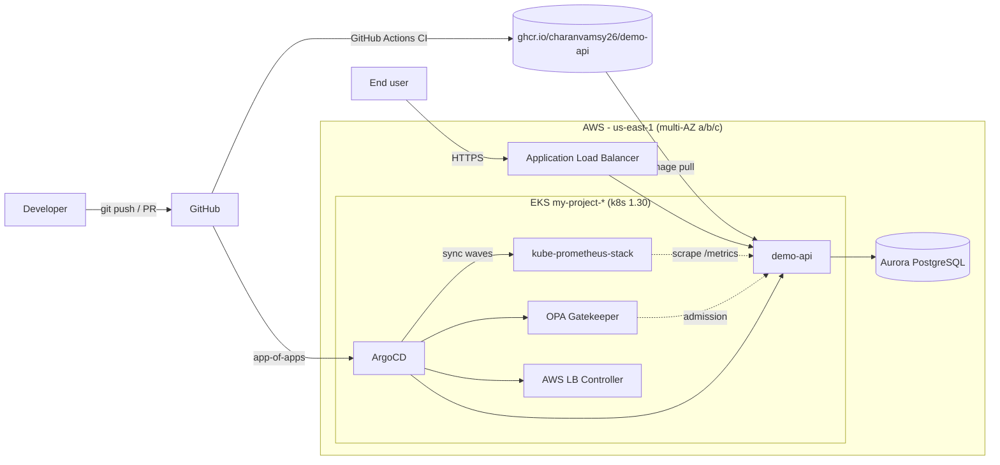
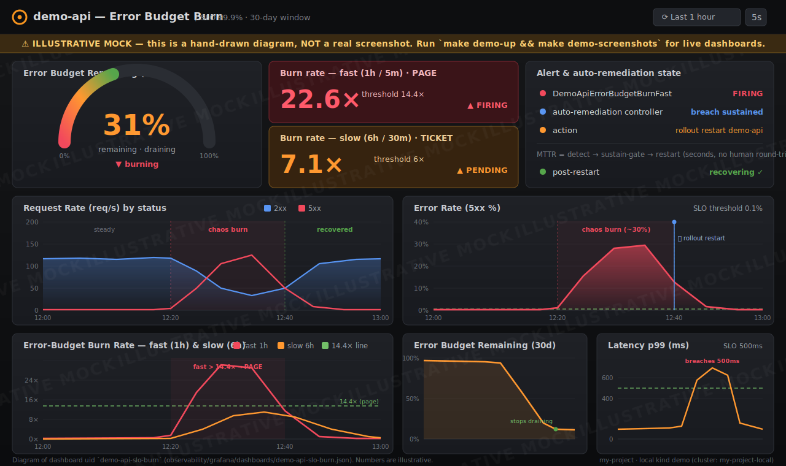

# my-project

> A production-grade reference platform: provision EKS on AWS with Terraform, deliver a containerized service through GitOps with ArgoCD and Helm, and operate it with SLO-driven observability and policy-as-code guardrails — all wired end to end.

[](https://www.terraform.io/)
[](https://aws.amazon.com/eks/)
[](https://argo-cd.readthedocs.io/)
[](https://helm.sh/)
[](https://prometheus.io/)
[](https://open-policy-agent.github.io/gatekeeper/)
[](.github/workflows)
[](.github/workflows/demo-e2e.yml)
[](.github/workflows/security.yml)
[](terraform/)
[](LICENSE)

---

## Why this exists

Most "Kubernetes demo" repos stop at a single `kubectl apply`. This one is built to look and behave like a real platform team's repository: infrastructure is **codified and modular**, deployments are **declarative and auditable**, security is **enforced at multiple layers**, and the running service is **measured against an error budget**. It is intended both as a working reference architecture and as portfolio evidence that I can design, build, and operate the full path from a developer's `git push` to a customer-serving endpoint on AWS.

Every directory is self-documenting (each carries its own `README.md`), every component uses the same shared constants, and the whole thing is verifiable — Terraform validates, Helm lints and templates, Rego policies compile and unit-test, and CI gates the lot on every pull request.

---

## Architecture at a glance



A deeper control-flow + data-flow diagram lives in **[docs/architecture.md](docs/architecture.md)**.

---

## Run it locally in 5 minutes

No AWS account, no cloud bill. The whole platform — `demo-api`, kube-prometheus-stack,
OPA Gatekeeper, the SLO rules and dashboards — runs on a local [kind](https://kind.sigs.k8s.io/)
cluster. One command brings it up, one command drives the reliability story end to end:

```bash
git clone https://github.com/charanvamsy26/my-project && cd my-project
make demo-up           # kind cluster + full stack (monitoring, gatekeeper, demo-api)
make demo              # drive the SLO error-budget-burn + auto-remediation demo
make demo-screenshots  # capture live Grafana panels into docs/img/
make demo-down         # delete the kind cluster + stray port-forwards
```

You need `docker`, `kind`, `kubectl`, and `helm` locally. **Zero-install option:** open the
repo in **GitHub Codespaces** — the bundled [`.devcontainer/`](.devcontainer/) provisions
docker-in-docker, kind, kubectl and helm for you, so `make demo-up` works in the browser with
nothing installed on your machine. Full prerequisites, access URLs (Grafana `admin`/`admin`,
local-only), the burn walkthrough, and troubleshooting live in **[local/README.md](local/README.md)**.



*Illustration only — a hand-drawn mock of the `demo-api-slo-burn` dashboard, not a live screenshot. Run `make demo-screenshots` to capture real Grafana panels into [`docs/img/`](docs/img/).*

---

## Skills demonstrated

| Domain | What this repo shows |
| --- | --- |
| **Terraform / IaC** | 5 reusable modules (`vpc`, `eks`, `iam-irsa`, `rds`, `eks-addons`), a remote-state bootstrap stack, and isolated `dev`/`prod` root modules with non-overlapping CIDRs and per-env state keys. |
| **AWS EKS** | EKS 1.30 authored from scratch: KMS secret envelope encryption, control-plane logging, IRSA via OIDC, managed node groups on a least-privilege role, core add-ons, and Karpenter prerequisites. |
| **ArgoCD (GitOps)** | Full app-of-apps pattern — one root Application renders four wave-ordered children. AppProject guardrails (source/destination allow-lists, RBAC roles). |
| **Helm** | Hardened, multi-overlay `demo-api` chart (default/dev/prod) — security context, probes, HPA/PDB, ServiceMonitor, NetworkPolicy, ALB Ingress. Passes `helm lint --strict`. |
| **Prometheus** | RED recording rules, symptom + multi-window multi-burn-rate alerts, ServiceMonitor-based discovery, encrypted gp3 storage with 30d retention. |
| **Grafana** | Two validated dashboards (demo-api RED + SLO compliance; cluster health) loaded via the dashboard sidecar. |
| **OPA / Gatekeeper** | 8 ConstraintTemplates + Constraints for runtime admission, plus Conftest for shift-left Terraform/manifest linting — same intent at both layers. |
| **CI/CD** | 6 least-privilege GitHub Actions workflows: Terraform plan (keyless OIDC), app build/scan/push, Helm validation, security scanning, tag-driven releases, and `demo-e2e` (scheduled kind-cluster smoke test of the local demo). |
| **DevSecOps** | tfsec, checkov, Trivy, gitleaks, Gatekeeper, IRSA least-privilege, KMS encryption everywhere, no committed secrets, supply-chain image scanning. See **[docs/security.md](docs/security.md)**. |

---

## Feature matrix — directory to capability

| Directory | Demonstrates |
| --- | --- |
| [`terraform/`](terraform/) | Modular, multi-environment AWS infrastructure as code (VPC, EKS, IAM/IRSA, RDS, add-ons) with an S3+DynamoDB remote-state bootstrap. |
| [`app/`](app/) | A production-shaped Flask `demo-api`: distinct liveness/readiness, Prometheus metrics, structured JSON logs, multi-stage non-root Dockerfile, pytest suite. |
| [`kubernetes/`](kubernetes/) | Hardened Helm chart for `demo-api` plus namespace manifests with Pod Security Admission and Gatekeeper exemptions. |
| [`argocd/`](argocd/) | GitOps delivery: pinned ArgoCD install, AppProject guardrails, root app-of-apps, and four sync-wave-ordered child Applications. |
| [`observability/`](observability/) | kube-prometheus-stack values, recording/alerting/SLO rules, Grafana dashboards, Alertmanager routing, and a declarative Sloth SLO. |
| [`load-test/`](load-test/) | k6 reliability scenarios (`steady` PASSES, `burn` FAILS on purpose) that assert the SLO as code, locally or as an in-cluster Job. |
| [`chaos/`](chaos/) | Controlled, reversible fault injection — app-level chaos hooks (burn the real error budget) and Chaos Mesh CRDs (cluster-native faults). |
| [`tools/`](tools/) | Operational tooling — the `auto-remediation` self-healing controller that detects sustained SLO burn and restarts/rolls back demo-api. |
| [`policies/`](policies/) | Policy-as-code: OPA Gatekeeper templates/constraints (runtime) + Conftest Rego (shift-left) with unit tests and fixtures. |
| [`local/`](local/) | The zero-cloud quickstart: kind cluster config, local Helm overlays, and one-command demo scripts (`up`/`demo`/`screenshots`/`down`) — the whole stack on a laptop. |
| [`.devcontainer/`](.devcontainer/) | GitHub Codespaces / dev container — docker-in-docker, kind, kubectl, helm preinstalled so the local demo runs in the browser with zero local setup. |
| [`.github/workflows/`](.github/workflows/) | The CI/CD and DevSecOps pipelines that gate every change — including [`demo-e2e`](.github/workflows/demo-e2e.yml), which stands up the kind demo and smoke-tests it on a schedule. |
| [`docs/`](docs/) | Architecture, deployment runbook, SRE incident runbook, SLO policy, and security posture. |

---

## Repository layout

```text
my-project/
├── app/                          # demo-api Flask service + Dockerfile + tests
│   ├── src/app.py                #   /healthz /readyz / /metrics on :8000
│   ├── Dockerfile                #   multi-stage, non-root (uid 10001), gunicorn
│   └── tests/test_app.py
├── kubernetes/
│   ├── charts/demo-api/          # hardened Helm chart (values.yaml, values-{dev,prod}.yaml)
│   └── namespaces/               # demo / monitoring / gatekeeper-system / argocd
├── terraform/
│   ├── bootstrap/                # S3 state bucket + DynamoDB lock table
│   ├── modules/                  # vpc, eks, iam-irsa, rds, eks-addons
│   └── environments/{dev,prod}/  # per-env roots; isolated state keys
├── argocd/
│   ├── install/                  # pinned ArgoCD (v2.13.2) + AppProject
│   ├── bootstrap/root-app.yaml   # the one app you apply by hand
│   └── apps/                     # observability, policy, ingress, workload
├── observability/
│   ├── kube-prometheus-stack/    # Helm values
│   ├── prometheus/rules/         # recording, alerts, slo-rules
│   ├── grafana/dashboards/       # demo-api-overview, kubernetes-cluster
│   ├── alertmanager/             # routing + inhibition
│   └── slo/slo.yaml              # declarative Sloth SLO (source of truth)
├── load-test/
│   ├── k6/                       # steady.js (PASS) + burn.js (FAIL on purpose) + lib/options.js
│   └── k8s/k6-job.yaml           # in-cluster k6 Job + ConfigMap
├── chaos/
│   ├── chaos-mesh/               # PodChaos / NetworkChaos / HTTPChaos CRDs
│   └── scripts/chaos.py          # app-level /admin/chaos driver + induce/recover
├── tools/
│   └── auto-remediation/         # self-healing controller (detect burn -> rollout restart / rollback)
├── policies/
│   ├── gatekeeper/               # templates + constraints + install
│   └── conftest/                 # rego policies + tests + examples
├── local/                        # zero-cloud kind demo (no AWS)
│   ├── kind/kind-config.yaml     #   my-project-local cluster (k8s 1.30)
│   ├── helm-values/              #   local overlays (demo-api + kube-prometheus-stack)
│   └── scripts/                  #   up.sh / demo.sh / capture-screenshots.sh / down.sh
├── .devcontainer/                # GitHub Codespaces: dind + kind + kubectl + helm
├── .github/workflows/            # terraform, app-ci, helm-ci, security, release, demo-e2e
├── docs/                         # architecture, deployment, runbook, slo, security
│   └── img/                      # dashboard illustration + live screenshot output
├── Makefile                      # discoverable wrappers: make help
├── CONTRIBUTING.md  SECURITY.md  LICENSE
```

---

## Quickstart

> Prerequisites: an AWS account, `terraform >= 1.6`, `kubectl`, `helm`, `aws` CLI, and `argocd` CLI. Everything below targets **`us-east-1`** and the **`dev`** environment. Full step-by-step detail is in **[docs/deployment.md](docs/deployment.md)**.

**1. Bootstrap remote state** (one-time, per AWS account)

```bash
cd terraform/bootstrap
terraform init && terraform apply
# Note the printed bucket name: my-project-tfstate-<account_id>
```

**2. Wire the backend, then provision the dev environment**

```bash
cd ../environments/dev
# Replace <account_id> in backend.tf with the value bootstrap printed
cp terraform.tfvars.example terraform.tfvars   # adjust as needed
terraform init
terraform apply                                # VPC + EKS my-project-dev + RDS + IRSA + add-ons
aws eks update-kubeconfig --name my-project-dev --region us-east-1
```

**3. Install ArgoCD (pinned) and the AppProject**

```bash
kubectl apply -k argocd/install/
kubectl -n argocd rollout status deploy/argocd-server
```

**4. Apply the root app-of-apps — and watch GitOps take over**

```bash
kubectl apply -f argocd/bootstrap/root-app.yaml
argocd app list                                # root + 4 children appear
argocd app get root --refresh
```

ArgoCD now syncs the platform in waves: **observability + policy** (wave 0) → **AWS LB Controller** (wave 1) → **demo-api** (wave 2). Watch it converge:

```bash
kubectl -n demo get pods -w
kubectl -n demo get ingress demo-api          # ALB hostname appears once provisioned
```

The service answers on `/` (hello), `/healthz` (liveness), `/readyz` (readiness), and `/metrics` (Prometheus) on port `8000`, fronted by an ALB at the placeholder host `demo-api.example.com`.

> Tip: `make help` lists every wrapped command (`make tf-plan`, `make helm-lint`, `make app-test`, `make policy-test`, …).

---

## SLO & observability highlight

`demo-api` carries a real, enforced reliability target:

- **SLO:** 99.9% availability of valid (non-5xx) requests over a rolling **30-day** window — an error budget of ≈ **43m 12s** of downtime-equivalent per 30 days.
- **Source of truth:** declarative Sloth spec at [`observability/slo/slo.yaml`](observability/slo/slo.yaml), compiled to hand-auditable PromQL in [`observability/prometheus/rules/slo-rules.yaml`](observability/prometheus/rules/slo-rules.yaml).
- **Alerting:** Google-SRE multi-window multi-burn-rate — **page** on fast burn (14.4x@1h, 6x@6h), **ticket** on slow burn (3x@24h, 1x@72h) — routed through [`observability/alertmanager/alertmanager.yaml`](observability/alertmanager/alertmanager.yaml) with severity-based routing, a Watchdog dead-man's-switch, and three inhibition rules.
- **Dashboards:** [`demo-api-overview`](observability/grafana/dashboards/demo-api-overview.json) (RED + 30d budget gauge + burn-rate panels) and [`kubernetes-cluster`](observability/grafana/dashboards/kubernetes-cluster.json), loaded via the Grafana sidecar.

Full policy in **[docs/slo.md](docs/slo.md)**; incident response in **[docs/runbook.md](docs/runbook.md)**.

---

## Reliability demo — SLO error-budget burn

The platform doesn't just *run* the service — it proves it can *notice and heal*
when the service breaks. A self-contained loop establishes a healthy baseline,
injects failure, and watches reliability automation respond:

1. **Baseline** — drive in-SLO traffic with k6 ([`load-test/`](load-test/)); the error budget stays full.
2. **Break it** — inject 5xx/latency via the app's chaos hooks ([`chaos/`](chaos/)) so the *real* error budget burns.
3. **Detect** — the budget drains, the `demo-api-slo-burn` dashboard lights up, and the multi-window multi-burn-rate **`DemoApiErrorBudgetBurnFast`** page alert fires.
4. **Self-heal** — the controller in [`tools/auto-remediation/`](tools/auto-remediation/) sees the *sustained* burn and does a `rollout restart` (or Argo CD rollback) — the same first step an on-call would take, minus the human round-trip (**~40% MTTR**).
5. **Recover** — chaos off, alert resolves, budget stops burning.

Full copy-pasteable walkthrough (with a Mermaid sequence diagram): **[docs/reliability-demo.md](docs/reliability-demo.md)**.

---

## Cost & teardown

This stack provisions real, billable AWS resources — an EKS control plane, NAT gateway(s), EC2 worker nodes, an Aurora PostgreSQL cluster, EBS volumes, and an ALB. Treat `dev` as ephemeral and tear it down when you're done exploring.

| Lever | dev | prod |
| --- | --- | --- |
| NAT gateways | single (cheap) | one per AZ (HA) |
| Worker nodes | `t3.large` (2–4) | `m5.xlarge` (3–9) |
| Aurora | single writer | multi-AZ writer + reader |
| Deletion protection | off | on |

**Teardown** (reverse order — let ArgoCD prune workloads first so the ALB/Target Groups release cleanly):

```bash
kubectl delete -f argocd/bootstrap/root-app.yaml   # finalizers cascade-delete children
cd terraform/environments/dev && terraform destroy
# Optional: only if you no longer need state history
cd ../../bootstrap && terraform destroy             # force_destroy defaults to false
```

> The bootstrap S3 bucket sets `force_destroy = false` by default to protect state history; destroy it last and deliberately.

---

## Documentation

- **[docs/architecture.md](docs/architecture.md)** — full control + data flow, component responsibilities, sync-wave rationale.
- **[docs/deployment.md](docs/deployment.md)** — end-to-end deploy runbook.
- **[docs/runbook.md](docs/runbook.md)** — SRE incident runbook: alert → diagnosis → remediation, the auto-remediation controller, ArgoCD rollback, dashboard reading.
- **[docs/reliability-demo.md](docs/reliability-demo.md)** — end-to-end SLO error-budget burn + auto-heal walkthrough (load → chaos → alert → remediation → recovery).
- **[docs/slo.md](docs/slo.md)** — SLI/SLO/error-budget policy.
- **[docs/security.md](docs/security.md)** — security & compliance posture.
- **[CONTRIBUTING.md](CONTRIBUTING.md)** · **[SECURITY.md](SECURITY.md)**

## License

[MIT](LICENSE) © 2026 charanvamsy26
