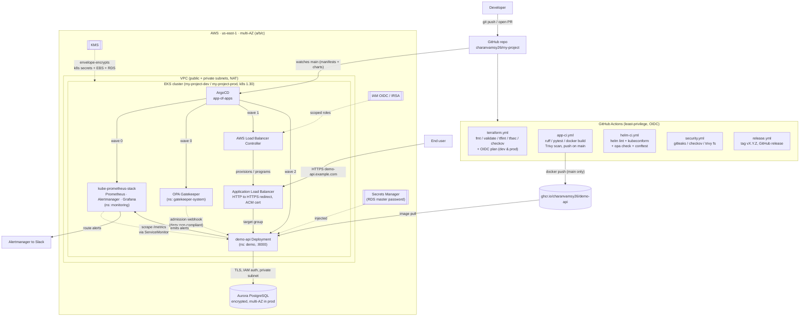

# Architecture

This document describes how `my-project` works end to end — from a developer's commit to a customer-serving HTTPS endpoint on AWS — and why each piece is shaped the way it is.

## Design principles

- **Everything as code, everything reviewable.** Infrastructure (Terraform), delivery (ArgoCD/Helm), observability (PrometheusRule/Grafana JSON), and policy (Rego) all live in Git and flow through pull requests.
- **GitOps is the only write path to the cluster.** Humans apply exactly one Application by hand (`root`); ArgoCD reconciles everything else from `main`. Manual `kubectl` edits are reverted by `selfHeal`.
- **Defense in depth.** The same intent — no `:latest`, required resource limits, non-root, approved registries — is enforced *shift-left* in CI (Conftest) and *at runtime* in the cluster (Gatekeeper admission).
- **Least privilege by default.** Per-service IRSA roles scoped to exact `namespace:serviceaccount` subjects; CI authenticates to AWS with keyless OIDC; ArgoCD's AppProject allow-lists sources, destinations, and cluster-scoped kinds.
- **Measured reliability.** The workload runs against a 99.9%/30d SLO with a real error budget and multi-burn-rate alerting.

## Full control + data flow

## Control plane vs data plane

- **Control plane (how things get deployed):** Developer → GitHub → (GitHub Actions builds & scans the image to GHCR) → ArgoCD reconciles manifests/charts from `main` → Kubernetes API. ArgoCD is the only continuous writer to the cluster.
- **Data plane (how a request is served):** End user → ALB (TLS termination via ACM) → `demo-api` Service/Pods on port 8000 → Aurora PostgreSQL (when `DATABASE_URL` is set; otherwise the service runs stateless and always-ready).

## Component responsibilities

### Infrastructure — `terraform/`
- **`bootstrap/`** creates the remote-state backend: a versioned, AES256-encrypted S3 bucket (`my-project-tfstate-<account_id>`) with all four public-access-block flags and a TLS-only bucket policy, plus a `PAY_PER_REQUEST` DynamoDB lock table (`my-project-tf-locks`) with point-in-time recovery.
- **`modules/vpc`** — multi-AZ VPC across `us-east-1a/b/c` with public/private subnets and NAT (single in dev, per-AZ in prod).
- **`modules/eks`** — EKS 1.30 with KMS envelope encryption of Kubernetes secrets (rotation on), full control-plane logging to CloudWatch, an IAM OIDC provider for IRSA, managed node groups on a least-privilege node role, core add-ons (vpc-cni / coredns / kube-proxy / ebs-csi), and Karpenter prerequisites (instance profile + SQS interruption queue + EventBridge rules).
- **`modules/iam-irsa`** — a role factory scoping each trust policy to an exact `namespace:serviceaccount` subject (`StringEquals`, no wildcards), shipping least-privilege policies for the AWS Load Balancer Controller, external-dns, Karpenter, and ebs-csi.
- **`modules/rds`** — encrypted, private, IAM-auth-enabled Aurora PostgreSQL with a generated master password stored in Secrets Manager (never in tfvars), enhanced monitoring, and prod-grade deletion-protection/final-snapshot toggles.
- **`environments/{dev,prod}`** — root modules that wire the modules together with environment-appropriate sizing and **isolated per-env S3 state keys**.

### Workload — `app/` and `kubernetes/`
- **`app/`** — the Flask `demo-api`. Liveness (`/healthz`) is process-only; readiness (`/readyz`) probes the DB and returns `503` (without crashing) when it can't serve. Metrics are exposed at `/metrics` with low-cardinality, route-templated labels. The image is multi-stage and runs gunicorn as non-root uid `10001` on `:8000`.
- **`kubernetes/charts/demo-api`** — a hardened Helm chart: `readOnlyRootFilesystem`, drop ALL capabilities, `runAsNonRoot`, seccomp `RuntimeDefault`, resource requests/limits, liveness/readiness/startup probes, `topologySpreadConstraints`, HPA + PDB (prod), ServiceMonitor, a default-deny NetworkPolicy with explicit allows, and an ALB Ingress (HTTP→HTTPS, ACM). Replicas are omitted when the HPA owns them so Helm doesn't fight the autoscaler.
- **`kubernetes/namespaces`** — `demo` under restricted Pod Security Admission; `gatekeeper-system` and `argocd` carry the Gatekeeper ignore annotation to avoid webhook self-deadlock.

### Delivery — `argocd/`
- **`install/`** pins upstream ArgoCD (v2.13.2) via a kustomize remote base and defines the `my-project` AppProject (source/destination allow-lists, cluster-scoped resource whitelist, a Secret blacklist, and read-only / platform-admin RBAC roles).
- **`bootstrap/root-app.yaml`** is the single hand-applied Application (wave -1). It renders `argocd/apps/` and creates the four children, so adding a platform component becomes a one-file PR.
- **Sync waves** enforce ordering (rationale below).

### Observability — `observability/`
- kube-prometheus-stack values, RED recording rules, symptom alerts, the compiled SLO rules, two Grafana dashboards, and the Alertmanager routing/inhibition config. Storage is encrypted gp3 with 30-day retention aligned to the SLO window.

### Policy — `policies/`
- Gatekeeper ConstraintTemplates + Constraints for runtime admission, and Conftest Rego for shift-left linting of Terraform plans and rendered manifests — both validated and unit-tested.

## Sync-wave rationale

| Wave | Application(s) | Why this order |
| --- | --- | --- |
| -1 | `root` (app-of-apps) | Renders the child Applications before any real workload syncs. |
| 0 | kube-prometheus-stack, Gatekeeper | CRDs and the admission webhook must exist first — so later workloads can register ServiceMonitors and pass admission. |
| 1 | AWS Load Balancer Controller | Must be running before any Ingress can provision an ALB. |
| 2 | demo-api | Deployed last: its ServiceMonitor has CRDs to bind to, its pods pass Gatekeeper, and its Ingress can program an ALB. |

## Environment differences

| Concern | dev | prod |
| --- | --- | --- |
| Cluster name | `my-project-dev` | `my-project-prod` |
| NAT | single | one per AZ |
| Worker nodes | `t3.large` (2–4) | `m5.xlarge` (3–9) |
| Aurora | single writer | multi-AZ writer + reader |
| Control-plane logs | lean | full audit |
| Deletion protection | off | on |
| Terraform state key | `environments/dev/terraform.tfstate` | `environments/prod/terraform.tfstate` |

## Shared constants

Region `us-east-1`; project tag `my-project`; image `ghcr.io/charanvamsy26/demo-api`; service port `8000`; namespaces `demo` / `monitoring` / `gatekeeper-system` / `argocd`; Kubernetes `1.30`. Every component uses these identically, which is what lets the pieces interlock without glue code.
