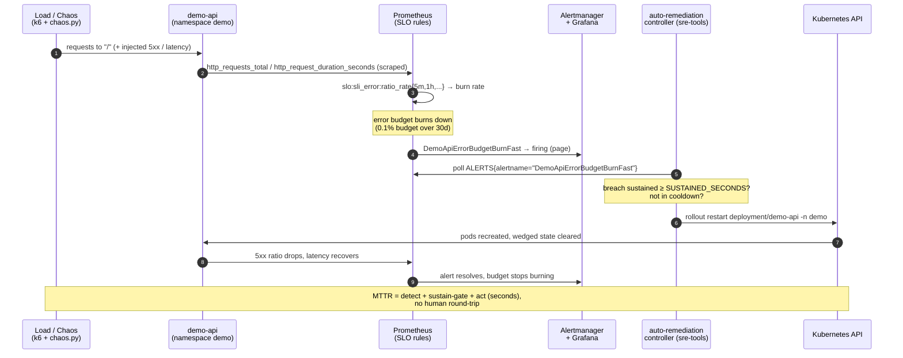

# Reliability demo — SLO error-budget burn, end to end

This is a **copy-pasteable walkthrough** that proves a complete SRE outcome on
the running `demo-api` platform: establish a healthy baseline, deliberately
break the service, watch the **99.9% / 30-day SLO** burn its error budget, see
the **multi-window multi-burn-rate page alert** fire, and then have an
**auto-remediation controller** detect the sustained burn and restart the
workload — collapsing MTTR — before recovering and tearing the experiment down.

Every component referenced here already exists in the repo. The pieces:

| Stage | Drives it | Lives in |
| --- | --- | --- |
| Load (baseline / overload) | k6 `steady.js` / `burn.js` | [`load-test/`](../load-test/) |
| Fault injection | app-level `chaos.py` (and Chaos Mesh CRDs) | [`chaos/`](../chaos/) |
| Metrics + SLO rules | recording/SLO/alert rules | [`observability/prometheus/rules/`](../observability/prometheus/rules/) |
| Dashboard | `demo-api-slo-burn` | [`observability/grafana/dashboards/demo-api-slo-burn.json`](../observability/grafana/dashboards/demo-api-slo-burn.json) |
| Page alert | `DemoApiErrorBudgetBurnFast` | [`observability/prometheus/rules/slo-rules.yaml`](../observability/prometheus/rules/slo-rules.yaml) |
| Auto-remediation | the self-healing controller | [`tools/auto-remediation/`](../tools/auto-remediation/) |

---

## The loop at a glance



---

## 0. Prerequisites

You need the platform running and a way to reach `demo-api`, Prometheus, and
Grafana. Pick one:

**Option A — full cluster (GitOps):** the platform is deployed and ArgoCD has
synced it (see [README Quickstart](../README.md#quickstart)). `demo-api` runs in
`demo`, kube-prometheus-stack runs in `monitoring` and scrapes the chart's
ServiceMonitor, and Grafana has the dashboards loaded via the sidecar.

**Option B — local via port-forward:** keep these forwards open in side
terminals (each blocks):

```bash
kubectl -n demo        port-forward svc/demo-api 8000:80                              # app   -> localhost:8000
kubectl -n monitoring  port-forward svc/kube-prometheus-stack-prometheus 9090:9090   # prom  -> localhost:9090
kubectl -n monitoring  port-forward svc/kube-prometheus-stack-grafana 3000:80        # graf  -> localhost:3000
```

> The Helm chart names the Service after the release fullname; this demo assumes
> it is exposed as `demo-api` (install with `--set fullnameOverride=demo-api`, or
> substitute your actual Service name). See [`load-test/README.md`](../load-test/README.md).

Shared env used throughout:

```bash
export BASE_URL=http://localhost:8000          # demo-api
export PROM_URL=http://localhost:9090          # Prometheus
export CHAOS_ADMIN_TOKEN='<the-demo-api-chaos-token>'   # the token demo-api was deployed with
```

> `CHAOS_ADMIN_TOKEN` is never stored in this repo. If it is unset on the pod,
> `/admin/chaos` is disabled (returns 404) — that is the safe default. **Never
> run chaos against production** — see the safety note in [`chaos/README.md`](../chaos/README.md).

---

## 1. Establish the baseline — error budget healthy

Open the Grafana **`demo-api-slo-burn`** dashboard (uid `demo-api-slo-burn`):

```
http://localhost:3000/d/demo-api-slo-burn        # or browse Dashboards → "demo-api SLO burn"
```

Drive steady, in-SLO traffic with the k6 **steady** scenario (chaos OFF — this
is the green path, expected to **PASS** / exit 0):

```bash
BASE_URL=$BASE_URL k6 run load-test/k6/steady.js
# or: make load-steady
```

**What you should see** on `demo-api-slo-burn`:

- **Error budget remaining** stat/gauge near **100%**.
- **Fast (1h) / slow (6h) burn-rate** panels flat, well under the 14.4× / 6× / 3×
  threshold lines.
- **5xx error rate** ~0; **p99 latency** comfortably under the 500 ms SLO line.
- k6 summary: every threshold ✓ (`p(99) < 500ms`, `slo_errors < 0.001`,
  `http_req_failed < 0.01`).

This is your "everything is healthy" reference. Leave a trickle of traffic
running in a side terminal so the rates stay populated:

```bash
while true; do curl -s "$BASE_URL/" >/dev/null; sleep 0.2; done
```

---

## 2. Induce failure — break demo-api on purpose

Use the app-level chaos driver (mechanism **B**), which routes faults through
demo-api's own `after_request` instrumentation so they are counted in
`http_requests_total{service="demo-api",path="/",status="500"}` and **burn the
real SLO budget**:

```bash
cd chaos/scripts
./chaos.py errors --rate 0.3      # 30% of "/" requests now return 500
# (equivalently: ./induce.sh   — defaults to 50% errors + 500ms latency)
```

Optionally also pile on load to accelerate the burn (the k6 **burn** scenario,
expected to **FAIL** / non-zero exit — that failure *is* the success criterion):

```bash
# In another terminal — ramps to PEAK_RATE and (with CHAOS_TOKEN) drives chaos too.
BASE_URL=$BASE_URL CHAOS_TOKEN=$CHAOS_ADMIN_TOKEN k6 run load-test/k6/burn.js
# or: make load-burn CHAOS_TOKEN=$CHAOS_ADMIN_TOKEN
```

> Cluster-native alternative (mechanism **A**): apply a Chaos Mesh manifest, e.g.
> `kubectl -n demo apply -f chaos/chaos-mesh/network-latency.yaml`. Note that
> Chaos Mesh **HTTPChaos** 500s are forged *outside* the app and are **not**
> counted in `http_requests_total` — for the SLO/error-budget story use
> mechanism B. See [`chaos/README.md`](../chaos/README.md).

---

## 3. Observe — the budget burns and the page alert fires

On `demo-api-slo-burn`, within a minute or two:

- **5xx error rate** climbs to roughly the injected fraction; **request rate by
  status** shows the `5xx` series (forced red) rising.
- **p99 latency** crosses the 500 ms SLO line if you injected latency.
- **Fast burn-rate (1h)** shoots above the **14.4×** threshold line; the
  **error-budget remaining** stat/gauge visibly **drains** down from 100%.

Confirm the SLO math directly in Prometheus (`http://localhost:9090`):

```promql
# Short-window 5xx error ratio (should be ≈ your injected error_rate):
slo:sli_error:ratio_rate5m{service="demo-api"}

# Fast burn rate (error ratio / 0.001 budget) — climbs above 14.4 during the burn:
slo:burn_rate:fast

# Error budget remaining (drains from 1.0 toward 0):
slo:error_budget:remaining_ratio30d
```

(`slo:burn_rate:fast/slow` and `slo:error_budget:remaining_ratio30d` are the
recording rules added in
[`observability/prometheus/rules/burn-demo-rules.yaml`](../observability/prometheus/rules/burn-demo-rules.yaml).)

Then watch the **multi-window multi-burn-rate page alert** fire. Its name comes
straight from [`observability/prometheus/rules/slo-rules.yaml`](../observability/prometheus/rules/slo-rules.yaml):

```promql
ALERTS{alertname="DemoApiErrorBudgetBurnFast", alertstate="firing"}
```

`DemoApiErrorBudgetBurnFast` (severity `critical`, the page) fires when the
**1h AND 5m** windows both exceed `14.4 × 0.001` (or the 6h/30m pair exceeds
`6 × 0.001`) — fast detection without single-blip false positives. Prometheus →
Status → Alerts will show it transition `pending` → `firing`; the dashboard's
built-in annotations also mark the firing region.

---

## 4. Auto-remediation — the controller detects and heals

The controller in [`tools/auto-remediation/`](../tools/auto-remediation/) polls
Prometheus for exactly that firing alert and, once the breach is **sustained**
and it is **not in cooldown**, performs the safe first-responder action —
`kubectl rollout restart deployment/demo-api -n demo`.

Run it pointed at the same Prometheus, **with execution enabled** (`DRY_RUN=false`)
for the live heal:

```bash
cd tools/auto-remediation
python3 -m pip install -r requirements.txt

PROM_URL=$PROM_URL \
DRY_RUN=false \
MODE=restart \
NAMESPACE=demo \
DEPLOYMENT=demo-api \
SUSTAINED_SECONDS=120 \
LOG_LEVEL=INFO \
python3 remediator.py
```

It emits one **structured single-line JSON log per decision**. Expected sequence
as the burn takes hold and is then remediated:

```json
{"level":"INFO","service":"auto-remediation","message":"breach detected","alertname":"DemoApiErrorBudgetBurnFast","mode":"alerts","breached":true}
{"level":"INFO","service":"auto-remediation","message":"breach sustained, evaluating remediation","sustained_seconds":120,"in_cooldown":false}
{"level":"WARNING","service":"auto-remediation","message":"remediating: rollout restart","action":"rollout_restart","namespace":"demo","deployment":"demo-api","dry_run":false,"via":"kubernetes"}
{"level":"INFO","service":"auto-remediation","message":"remediation applied; entering cooldown","cooldown_seconds":600}
```

> With `DRY_RUN=true` (the shipped default) the same path runs but logs
> `"DRY-RUN: would remediate but DRY_RUN is true; no changes made"` and changes
> nothing — use that first to prove the detection without touching the cluster.

**On the dashboard:** new pods come up, the wedged in-memory state is cleared,
**5xx error rate falls back toward 0**, **p99 recovers**, the **fast burn-rate
drops below the threshold line**, and `DemoApiErrorBudgetBurnFast` resolves
(`error-budget remaining` stops draining).

### Tie to MTTR

`MTTR = detect + acknowledge + diagnose + act`. The human path spends minutes on
*acknowledge + context-switch + type the command* before the first useful
keystroke. The controller is already watching the **same signal that pages a
human**, so it collapses that to `detect → sustain-gate → restart` in seconds —
the removed round-trip is the **~40% MTTR reduction**. The `SUSTAINED_SECONDS`
gate and `COOLDOWN_SECONDS` anti-flap mean speed does not cost stability (no
restart storms). Humans are still paged; the controller is the *first responder*,
the human is the *investigator* who arrives to a service already recovering and a
log of exactly what the bot did. Full detail in
[`tools/auto-remediation/README.md`](../tools/auto-remediation/README.md).

> A restart only *clears* a pod-local fault. A persistent chaos toggle re-burns
> after the restart — which is why a human still investigates, and why a
> bad-release incident uses `MODE=rollback` (`argocd app rollback`) instead.

---

## 5. Recover & teardown

Turn off every chaos knob (idempotent) and stop the helpers:

```bash
cd chaos/scripts && ./chaos.py off      # or ./recover.sh — clears errors/latency/outage
# Ctrl-C the curl loop, the k6 runs, and the remediator.
# If you used Chaos Mesh manifests:
kubectl -n demo delete -f chaos/chaos-mesh/ --ignore-not-found
```

Confirm green on `demo-api-slo-burn`: 5xx ratio back to ~0, burn-rate flat,
budget remaining steady, `DemoApiErrorBudgetBurnFast` no longer firing. A final
`k6 run load-test/k6/steady.js` should PASS again, proving the loop returned to
baseline.

> If you ran the controller in-cluster, scale it back down or leave it on
> `DRY_RUN=true`. To temporarily silence it entirely, see the controller section
> of [`docs/runbook.md`](runbook.md#auto-remediation-controller-self-healing).

---

## What this demonstrates

> **SRE skills this loop proves, mapped to the artifacts:**
>
> - **SLI/SLO/error-budget design** — a real 99.9% / 30-day availability SLO with
>   hand-auditable PromQL recording rules; the budget is watched draining live.
> - **Multi-window multi-burn-rate alerting** (Google SRE method) — the
>   `DemoApiErrorBudgetBurnFast` page fires on a fast burn (14.4×@1h/5m or
>   6×@6h/30m), not on single-scrape blips.
> - **Observability** — a metric contract (`http_requests_total`,
>   `http_request_duration_seconds`) wired through recording rules to a purpose-
>   built Grafana burn dashboard.
> - **Performance / load testing** — k6 scenarios that assert the SLO as code
>   (`steady` PASSES, `burn` FAILS on purpose).
> - **Chaos engineering** — controlled, reversible fault injection at both the app
>   layer (burns the real budget) and the cluster layer (Chaos Mesh).
> - **Auto-remediation / self-healing & MTTR reduction** — a least-privilege
>   controller that acts on the same signal that pages a human, with sustain +
>   cooldown safety, closing the detect→act loop in seconds.
> - **Incident response & GitOps** — the same actions an on-call would take
>   (`rollout restart`, `argocd app rollback`), documented in the runbook.
